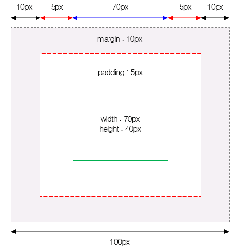

# box model

모든 HTML 요소는 박스 모양으로 구성되며, 이것을 박스 모델이라고 부른다.

박스 모델은 HTML 요소를 padding, border, margin, content로 구분한다.

1. 내용(content) : 텍스트나 이미지가 들어있는 박스의 실질적인 내용 부분
2. 패딩(padding) : 내용과 테두리 사이의 간격. 패딩은 눈에 보이지 않는다.
3. 테두리(border) : 내용과 패딩 주변을 감싸는 테두리
4. 마진(margin) : 테두리와 이웃하는 요소 사이의 간격. 마진은 눈에 보이지 않는다.

**HTML 요소의 전체 너비 계산 공식**

width + left padding + right padding + left border + right border + left margin + right margin

**HTML 요소의 전체 높 계산 공식**

height + top padding + bottom padding + top border + bottom border + top margin + bottom margin

### padding

---

내용과 테두리 사이의 간격(안쪽 여백)인 패딩 영역의 크기를 설정

패딩 영역은 background-color 속성으로 설정하는 배경색의 영향을 함께 받는다.

**padding 속성**

축약 표현 : padding: top right bottom left;

padding-top

padding-right

padding-bottom

padding-left

### border

---

내용과 패딩 영역을 둘러싸는 테두리 스타일을 설정

| 속성 | 설명 |  |
| --- | --- | --- |
| border | width, sytle, color 순서 |  |
| border-style | 테두리 모양 설정 |  |
| border-width | 테두리 두께 설정 | px, ghin, ghick |
| border-color | 테두리 색상 설정 |  |
| border-radius | 테두리 모서리 둥글게 | px, % |
| box-shadow | 그림자 효과 | |

**border-style 속성**

dotted : 점선

dashed : 대쉬 점선

solid : 실성

double : 이중 실선

groove : 3차원인 입체적인 선으로 설정하며, border-color 속성값에 영향을 받음.

ridge : 3차원인 능선효과가 있는 선으로 설정하며, border-color 속성값에 영향을 받음.

inset :  3차원인 내지로 끼운 선으로 설정하며, border-color 속성값에 영향을 받음.

outset : 3차원인 외지로 끼운 선으로 설정하며, border-color 속성값에 영향을 받음.

none : 테두리를 없앰.

hidden : 테두리가 존재하기는 하지만 표현되지는 않음.

### margin

---

테두리와 이웃하는 요소 사이의 간격인 마직 영역(바깥 여백)의 크기를 설정

패딩과 달리 background-color 속성으로 설정하는 배경색의 영향을 받지 않는다.

**margin 속성**

축약 표현 : margin : top right bottom left;

margin -top

margin -right

margin -bottom

margin -left

### outline

---

HTML 요소의 가장 바깥 부분을 둘러싸고 있는 아웃라인 부분의 스타일을 설정

border 속성과 마찬가지로 style, width, color 속성을 가짐

하지만 border 속성과 달리 HTML 요소의 전체 크기에는 포함되지 않는다.

HTML 요소의 높이나 너비는 전혀 영향을 받지 않는다.
