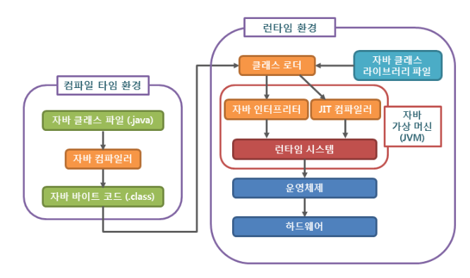

# 자바

## 자바의 역사

---

자바의 전신은 1991년 가전 제품의 셋톱용 프로그램으로 만든 오크다.

이후 인터넷이 빠르게 발전하면서 인터넷 환경에 적용할 수 있도록 오크의 개발 방향을 바꿨는데, 이것이 자바의 시작이다.

1995년 ‘핫 자바’라는 웹 브라우저를 자바로 개발해 발표했으며,

1996년 자바 1.0을 정식 발표하면서 버전을 지속적으로 업그레이드 해왔다.

## 자바의 특징

---

장점

🔸 자바는 운영체제와는 독립적으로 실행할 수 있다.

🔸 자바는 자동 메모리 관리 등을 지원하여 다른 언어에 비해 안전성이 높다.

🔸 자바는 연산자 오버로딩을 금지하고 제네릭을 도입함으로써 코드의 가독성을 높혔다.

단점

🔸 자바는 실행을 위해 자바 가상 머신을 거쳐야 하므로, 다른 언어에 비해 실행 속도가 느리다.

🔸 자바는 예외 처리가 잘 되어 있지만, 개발자가 일일이 처리를 지정해 줘야 한다는 불편함이 있다.

🔸 자바는 다른 언어에 비해 작성해야 하는 코드의 길이가 긴 편이다.

## 자바 프로그래밍

---

### 자바 프로그램 실행 과정

### 자바 컴파일러

자바를 가지고 작성한 자바 소스 코드를 자바 가상 머신(JVM)이 이해할 수 있는 자바 바이트 코드로 변환

자바 컴파일러는 자바를 설치하면 javac.exe라는 실행 파일 형태로 설치된다.

### 자바 바이트 코드

자바 가상 머신(JVM)이 이해할 수 있는 언어로 변환된 자바 소스 코드를 의미

자바 컴파일러에 의해 변환되는 코드의 명령어의 크기가 1바이트라서 자바 바이트 코드라고 불린다.

자바 바이트 코드의 확장자는 .class이다.

자바 바이트 코드는 자바 가상 머신(JVM)만 설치되어 있으면, 어떤 운영체제에서라도 실행될 수 있다.

### 자바 가상 머신(JVM)

자바 바이트 코드를 실행시키기 위한 가상의 기계라고 생각할 수 있다.

자바로 작성된 모든 프로그램은 자바 가상 머신에서만 실행될 수 있으므로, 자바 프로그램을 실행하기 위해서는 반드시 자바 가상 머신이 설치되어 있어야 한다.

따라서 개발자는 한 번만 프로그램을 작성하면, 모든 운영체제해서 사용할 수 있는 장점이 있다.

단, 자바 프로그램과는 달리 자바 가상 머신은 운영체제에 종속적이므로, 각 운영체제에 맞는 자바 가상 머신을 설치해야 한다.
