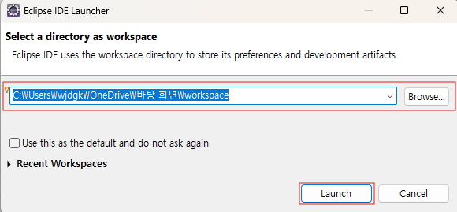
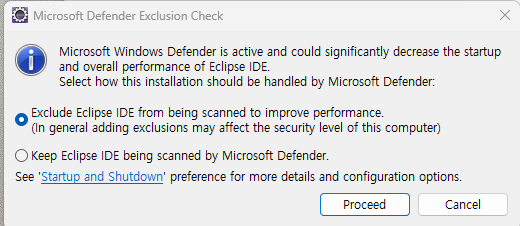

# 자바 개발 환경

자바를 개발하기 위해서는 JDK와 개발도구(이클립스, IntelliJ 등)를 설치해야 한다.

### 1. JDK 설치하기

[https://www.oracle.com/java/technologies/downloads/](https://www.oracle.com/java/technologies/downloads/)

오라클 사이트에 접속해 [모든 쿠키 수락]을 클릭한다.

본인의 운영체제에 맞는 프로그램을 다운로드한다.

### 2. 이클립스 설치

https://www.eclipse.org/downloads/

사이트에 접속한 후 운영체제에 맞게 다운로드 한다.

### 3. 이클립스 구성 및 환경 설정

🔸 작업 위치 지정하기

이클립스를 처음 실행하면 작업할 폴더의 위치를 지정한는 대화상자가 나타난다.

작업 폴더를 지정 → Lanch

1. Exclude Eclipse IDE from being scanned to improve performance

- 이 옵션을 선택하면 Windows Defender가 eclipse IDE와 관련된 파일을 스캔하지 않게 설정됩니다. 그 결과 eclipse의 성능이 더 좋아질 수 있지만, 이는 시스템 보안에 약간의 영향을 미칠 수 있습니다. 즉, eclipse 관련 파일에서 문제가 발생할 때 스캔이 이루어지지 않습니다.

2. Keep Eclipse IDE being scanned by Microsoft Defender

- 이 옵션은 Windows Defender가 eclipse IDE 파일을 계속 스캔하도록 유지하는 것입니다. 이 경우 보안은 유지되지만, eclipse IDE의 성능이 저하될 수 있습니다.

성능을 중시하는 경우 → 첫 번째

보안을 중시하는 경우 → 두 번째

🔸 이클립스에서 설정 바꾸기

[Window → Preferences] 메뉴 선택

글꼴 바꾸기

[Preferences] → [General → Appearance → Colors and Fonts → Basic → Text Font]

텍스트 인코딩 변경

[Preferences] → [General → Workspace → Text file encoding → Other: UTF-8]
