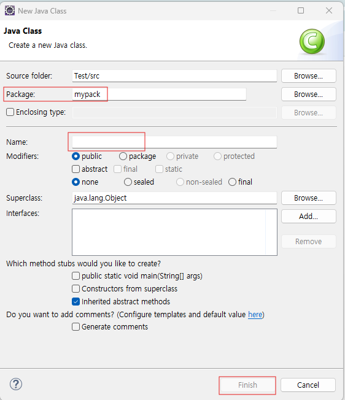

# 자바 프로젝트 생성

### 자바 프로젝트 생성

1. 이클립스를 실행 → 워크스페이스 설정 후 Launch

1. [File → New → Java Project] 를 생성 또는

   

   위 아이콘을 클릭해 생성

프로젝트명 입력 → JRE 버전 확인 → Finish

### 패키지 생성하기

1. 프로젝트 폴더를 선택한 후 마우스 우클릭 → [New → Package]

패키지명을 입력한 후 Finish 버튼 클릭

### 자바 소스 파일 생성하기

1. 프로젝트 폴더를 선택한 후 마우스 우클릭 → [New → Class]

🔸 패키지를 별도로 생성하지 않고 이 단계에서 입력해 한 번에 생성 가능

클래스명 입력 후 Finish 버튼 클릭

소스 파일과 클래스명은 동일

public static void main(String[] args){ } 소괄호 안의 내용을 콘솔창에 출력하는 기능 수행
